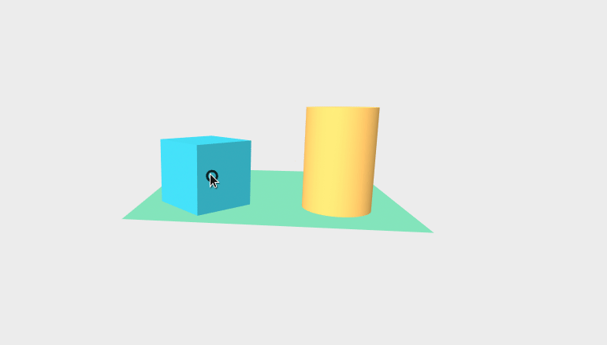

# Shoot

Shoot is an A-Frame component that allows a player to shoot a bullet on mouseclick.

## Installation

Include the component file in the head of your HTML document:

```html
<script type="text/javascript" src="shoot.js"></script>
```

## Usage

```html
<a-camera shoot="rate: 0.01; bullet: #bullet">
  <a-sphere 
  	id="bullet" 
  	radius=".1" 
  	color="#EF2D5E">
  </a-sphere>
  <a-cursor></a-cursor>
</a-camera>
```

Attach the `shoot` component to your `<a-camera>`, and pass in the relevant parameters. The bullet should be attached to the camera for this to work.

## Parameters

| Parameter          | Default | Description |
|--------------------|---------|-------------|
| **rate**           | 0.05    | The rate of speed that the bullet will shoot|
| **bullet**         | none    | A CSS selector for the bullet that should shoot|

## Example



## Contributing
Pull requests are welcome. For major changes, please open an issue first to discuss what you would like to change.


## License
[MIT](https://choosealicense.com/licenses/mit/)
